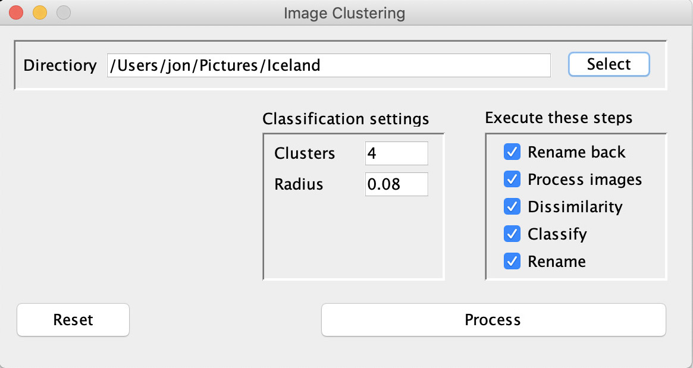

# ImageClustering: Content-Based Image File Renaming Tool

This is a hobby project that I did back in 2008 based on JAI (Java Advanced Imaging API).

Its purpose is to take a directory of image files (e.g. JPEG or PNG) with any name and bring order to chaos
based on the actual content. The pipeline starts with image feature extraction techniques, then calculate dissimilarity between those features and finally perform classification using a [self-organizing map for clustering](http://somlib.gforge.inria.fr/).

The code comes with a couple of nifty features such as multi-threaded processing and distributing work over the network
to different nodes. Also, it has a basic Swing UI:

# Building

Clone the repository and execute Maven from the root directory:

    $ git clone https://github.com/jonfryd/ImageClustering
    $ cd ImageClustering/
    $ mvn clean install

# Usage

After building, run e.g. the UI as:

    $ ./runImageClustering.sh

This is for Linux or Mac OS X. For Windows run .bat-file:

    $ runImageClustering.bat

When the UI is launched, select the directory, enter the expected number of clusters and press 'Process'.
Images are then analyzed and renamed with a C###-prefix denoting the cluster each image belongs to.

Happy renaming.

# Author

This application created by Jon Frydensbjerg - email: jonf@elixlogic.com
