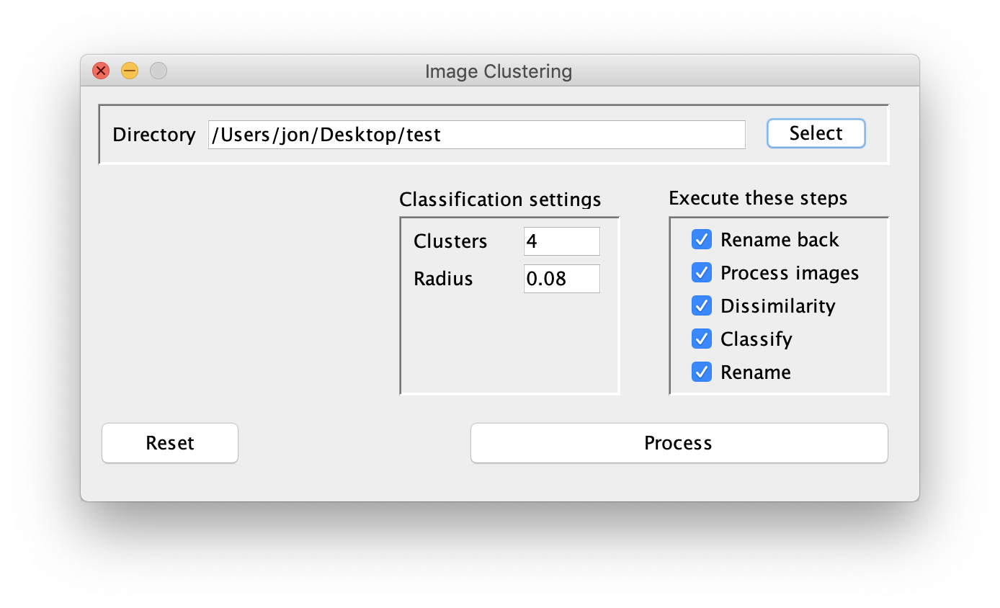
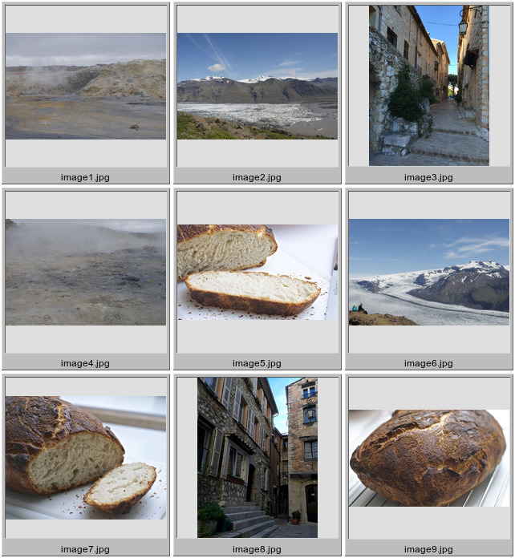
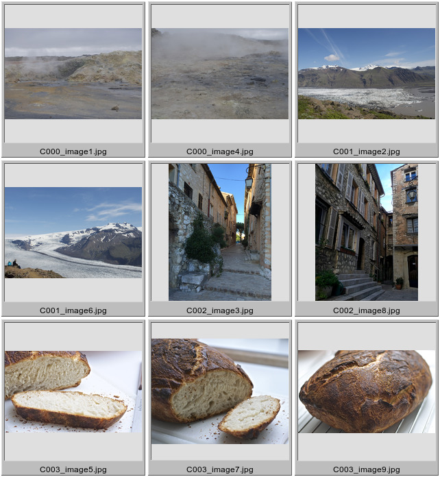

[](http://www.oracle.com/technetwork/java/javase)
[](https://opensource.org/licenses/MIT)

# ImageClustering: Content-Based Image File Renaming Tool

This is a hobby project I did back in 2008-2009 based on Java Advanced Imaging API.

Its purpose is to take a directory of image files with any name and bring order to chaos
based on pattern recognition of the actual contents. The pipeline starts with image feature extraction techniques (DCT perceptual hash,
texture histograms, edge histograms, etc.), then calculate dissimilarity between those features and finally perform
classification using a fast implementation of a self-organizing map for clustering based on [research done at Inria](http://somlib.gforge.inria.fr/).

The code comes with a couple of nifty features such as multi-threaded processing and distributing work over the network
to different nodes. Also, it has a basic Swing UI:



Radius is a hyper-parameter that controls the size of each cluster. The default value is fine for the most part.

# Example

Here are 9 images named in sequence (```image1.jpg```, ```image2.jpg```, ..., ```image9.jpg```):



Obviously they can be grouped into four clusters of 2, 2, 2 and 3 images, respectively. After processing the directory
the files are renamed as follows:



... Voila!

# Building

Clone the repository and execute Maven from the root directory:

    $ git clone https://github.com/jonfryd/ImageClustering
    $ cd ImageClustering/
    $ mvn clean install

# Usage

After building, run e.g. the UI as:

    $ ./runImageClustering.sh

This is for Linux or Mac OS X. For Windows run .bat-file:

    $ runImageClustering.bat

When the UI is launched, select the directory, enter the expected number of clusters and press 'Process'.
Images are then analyzed and renamed with a C###_-prefix denoting the cluster each image belongs to.

Happy renaming.

# Author

This application created by Jon Frydensbjerg - email: jonf@elixlogic.com
